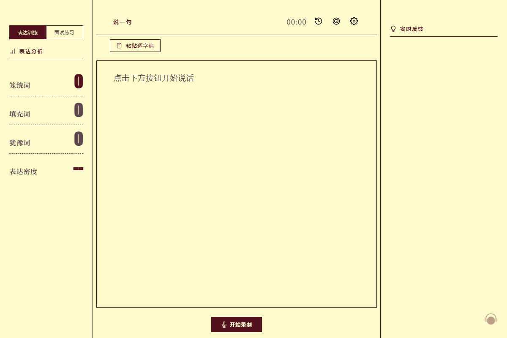
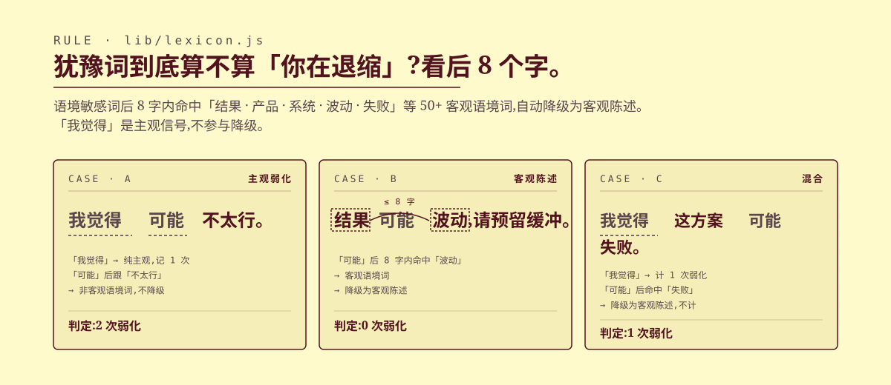
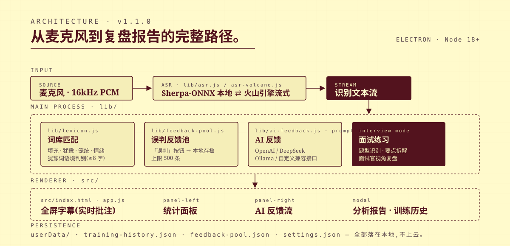
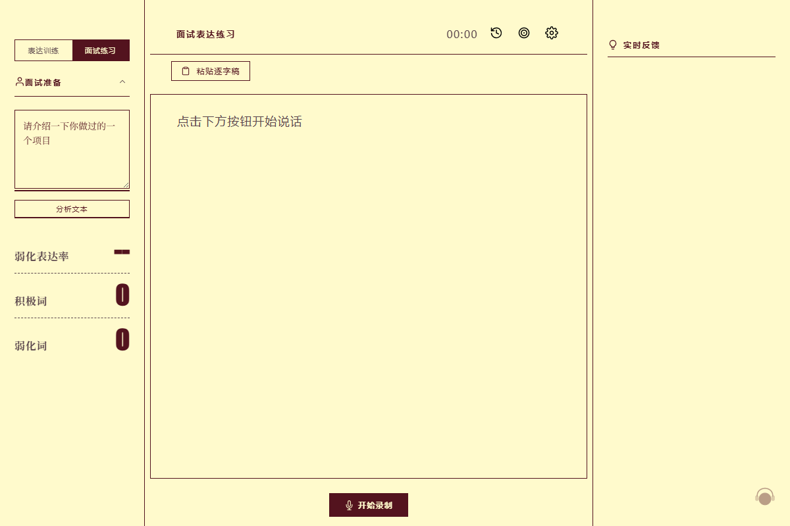
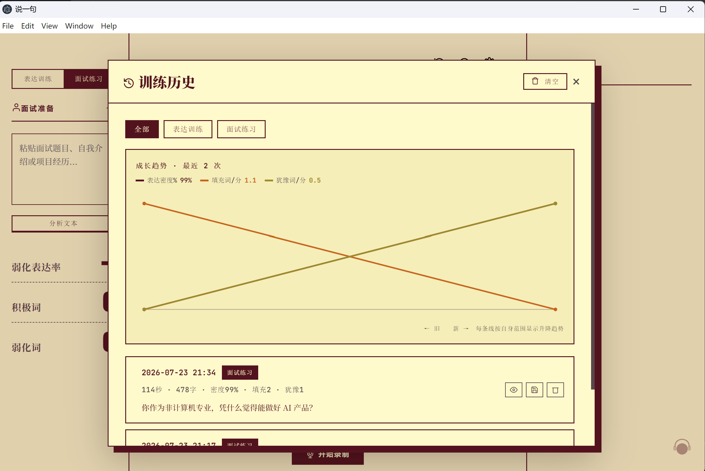

<p align="center">
  
</p>

<p align="center">
  <sub>Electron · Sherpa-ONNX · Node 18+ · MIT · v1.1.0</sub>
</p>

<p align="center">
  
</p>

<p align="center">
  
</p>

「说一句」是一个本地桌面应用。你说话,它把「嗯 / 那个 / 我觉得 / 可能」这些拖慢表达的词当场标出来,把「不错的吧」这类笼统词换成更精准的说法,说完给你一份多维复盘报告。

语音识别在本地跑(也可切换火山引擎云端),数据不上云,词库分析和历史记录都落在你自己的 `userData/`。

<p align="center">
  
</p>

大部分口语训练工具会把所有「可能 / 也许」都算成弱化表达,导致「结果可能波动」「产品也许失败」这种客观陈述被冤枉。

**「说一句」用一条明确的规则处理这件事**:

> 语境敏感词后 8 字内出现「结果 / 产品 / 系统 / 波动 / 失败」等 50+ 客观语境词时,自动降级为客观陈述,不计入弱化。「我觉得」是纯主观信号,不参与降级。

规则完整实现在 [`lib/lexicon.js`](./lib/lexicon.js),三个真实案例:

<p align="center">
  
</p>

**另一件不一样的事**:每条 hedge / vague / filler 反馈尾部都有「误判」按钮。点击后写入本地反馈池(`userData/feedback-pool.json`,上限 500 条),作为后续优化判别规则、训练 LLM 二次判别的数据基础。降级为客观陈述的犹豫词也会单独提示,同样可标记。

判别规则是硬编码 + 词库驱动的,不是黑盒,你能看懂它为什么这么标。

<p align="center">
  
</p>

<p align="center">
  
</p>

字幕上的批注遵循一套「Field Guide」的手写批改风格,不是彩色标注:

| 批注 | 样式 | 匹配对象 | 词表 |
|------|------|---------|------|
| 波浪下划线(深酒红) | `text-decoration: underline wavy` | **填充词** | 嗯 / 啊 / 那个 / 然后… 共 24 个 |
| 虚线下划线(灰褐) | `border-bottom: 2px dashed` | **犹豫词** | 可能 / 也许 / 我觉得 / 好像… 共 14 个,7 个参与语境降级 |
| 深酒红填色块(反白) | 深酒红底 + 浅黄纸文字 | **笼统词** | 开心 / 很好 / 不错的 / 想想… 每条给 6 个精准替代 |
| 深酒红加粗 | 无下划线,加粗 | **有力表达** | 情绪词库中 intensity ≥ 7 的词 |

样式定义在 [`src/styles.css`](./src/styles.css) 的 `.filler / .hedge / .vague` 选择器,词表在 [`data/emotion-lexicon.json`](./data/emotion-lexicon.json)。

<p align="center">
  
</p>

### 1. 克隆项目 & 安装依赖

```bash
git clone https://github.com/Liliane0310/shuoyiju.git
cd shuoyiju
npm install
```

需要 Node.js 18+(推荐 20 LTS)。安装过程中会下载 Electron 二进制(约 100MB)和 sherpa-onnx 原生模块,请保持网络通畅。项目默认配置了国内 npm 镜像(`.npmrc`)。

### 2. 下载语音识别模型

Sherpa-ONNX 的 streaming paraformer 中英双语模型(约 227MB):

```bash
cd models

# 方法一:wget
wget https://github.com/k2-fsa/sherpa-onnx/releases/download/asr-models/sherpa-onnx-streaming-paraformer-bilingual-zh-en.tar.bz2
tar xvf sherpa-onnx-streaming-paraformer-bilingual-zh-en.tar.bz2

# 方法二:huggingface
# https://huggingface.co/csukuangfj/sherpa-onnx-streaming-paraformer-bilingual-zh-en
```

下载后 `models/` 目录应包含:

```
models/
└── sherpa-onnx-streaming-paraformer-bilingual-zh-en/
    ├── encoder.int8.onnx
    ├── decoder.int8.onnx
    └── tokens.txt
```

模型文件较大,已通过 `.gitignore` 排除。

### 3. 启动

```bash
npm start
```

启动后点击右上角 ⚙️ 进入设置,配置 AI 后端:

| 后端 | 费用 | 速度 | 获取方式 |
|------|------|------|---------|
| DeepSeek | 极低 | 快 | [platform.deepseek.com](https://platform.deepseek.com) |
| OpenAI | 中等 | 快 | [platform.openai.com](https://platform.openai.com) |
| Ollama | 免费 | 取决于硬件 | [ollama.com](https://ollama.com) 本地运行 |

推荐 DeepSeek——生成报告质量高、成本极低。

### 4. 开始训练

1. 点「开始录制」→ 对着麦克风说话
2. 中央字幕实时显示、批注就地叠加
3. 左侧统计填充/犹豫/笼统/表达密度
4. 右侧每 50 字给一次 AI 实时反馈
5. 点「结束」→ 点「生成报告」拿到完整分析

## 面试练习模式

<p align="center">
  
</p>

粘贴面试题目 → AI 识别题型并拆解要点(结构化卡片)→ 录制回答 → 面试官视角复盘报告。

面试词库融合六类来源(在 [`data/interview-lexicon.json`](./data/interview-lexicon.json)):

| 来源 | 用途 |
|------|------|
| Hedging 语言学(Lakoff 1972 / Hyland 1998) | 模糊限制语识别 |
| Russell 情绪环形模型 | 效价 × 唤醒度四象限 |
| Fiske 刻板印象内容模型 | warmth × competence 双维印象 |
| STAR 法则 / 行为面试法 BBI | 过去行为预测未来 |
| 《终极面试问答》琳恩·威廉斯 | 三大基本问题 / 六大核心特质 |
| 《500 强企业面试题与面试流程全记录》鲁克德 | 16 家 500 强选人标准 |

## 训练历史

<p align="center">
  
</p>

历次训练本地存档,支持成长趋势图与 Markdown 导出。历史项一键「查看复盘」直接跳到当时的完整报告。

## 词库

### 表达训练词库

- [`data/emotion-lexicon.json`](./data/emotion-lexicon.json):基于大连理工情感词库 7 大类结构,650 词,含情绪词(category × intensity 1–9)、笼统词→精准词映射(25 组)、填充词表(24)、犹豫词表(14)、程度词梯度(弱→中→强→极)、画面化描述(10 组)、犹豫→直接转换(8 组)。
- [`data/tiered-lexicon.json`](./data/tiered-lexicon.json):分层词库辅助数据。

### 面试词库

- [`data/interview-lexicon.json`](./data/interview-lexicon.json):15 个分类,含 `confidenceMap`(弱化词→自信替代)、`emotionCircumplex`、`impressionDimensions`、`professionalVerbs`、`structureHints`、`weakWords / positiveWords / lowValueWords / powerWords`、`quantifierHints`、`interviewFramework`、`jobCategoryFocus`、`interviewQuestionTypes`、`fortune500Standards`、`interviewMethods`。
- [`data/interview-knowledge-base.json`](./data/interview-knowledge-base.json):上述两本面试书的结构化提炼,作为报告模板生成的背景素材。

## 开发

```bash
# 开发模式(带 DevTools)
npm run dev

# 运行核心逻辑测试(词库分析 / Prompt 构造 / 历史趋势渲染)
npm test
```

## 目录结构

```
shuoyiju/
├── main.js                # Electron 主进程
├── preload.js             # preload 脚本
├── start.js               # 启动器(清除 ELECTRON_RUN_AS_NODE)
├── src/
│   ├── index.html         # 主界面
│   ├── settings.html      # 设置页
│   ├── prompt-editor.html # 训练规则定制页
│   ├── lexicon-playground.html  # 词库调试页
│   ├── styles.css         # Field Guide 风格
│   ├── app.js             # 前端逻辑
│   └── settings.js        # 设置逻辑
├── lib/
│   ├── asr.js             # 本地语音识别(Sherpa-ONNX)
│   ├── asr-volcano.js     # 火山引擎云端流式识别
│   ├── lexicon.js         # 词库匹配 + 犹豫词语境判别
│   ├── ai-feedback.js     # AI 反馈(多后端)
│   ├── feedback-pool.js   # 误判反馈池(本地存档,供后续优化)
│   └── prompts.js         # Prompt 模板
├── data/                  # 词库
├── test/core.test.js      # 核心逻辑测试
├── models/                # Sherpa-ONNX 模型(需下载,已 gitignore)
├── assets/readme/         # README 视觉资源(SVG + 截图)
└── settings.example.json  # 设置示例(真实 settings.json 含 API Key,已 gitignore)
```

## 系统要求

- macOS 12+ / Windows 10+ / Linux
- Node.js 18+
- 麦克风权限
- 可选:网络(用于 AI 反馈,词库分析可完全离线)

## License

MIT

## 更新日志

详见 [CHANGELOG.md](./CHANGELOG.md)。
